DE ZÉRO À CRÉER UNE APPLI WEB
------------------------------

CE QU'IL FAUT COMPRENDRE D'ABORD

1. Java est différent de JavaScript 
JAVA 🔴

- Langage complètement différent
- Pour applications Android, logiciels d'entreprise
- Plus complexe
- PAS utilisé dans l'appli que j'ai fais 

JAVASCRIPT ✅

Langage du web (sites internet)
Plus facile pour débuter
Essentiel pour les applis web modernes

→ Si tu veux faire une appli web comme la démo que je t'ai fais = JAVASCRIPT, pas JAVA qui est plus de la logique pour Backend

-----------------------------------------------

TEMPS NÉCESSAIRE (RÉALISTE)
Pour faire une appli comme BookServices :
Niveau débutant complet → Capable de faire l'appli seul :

6-12 mois en travaillant 10-15h/semaine
3-6 mois en travaillant 20-30h/semaine (plus intense)

Pourquoi ça prend du temps ?

Apprendre les bases (HTML, CSS, JavaScript)
Apprendre un framework (React)
Apprendre le backend (Node.js)
Apprendre les bases de données (SQL)
Faire plusieurs petits projets avant

-----------------------------------------------------

🗺️ FEUILLE DE ROUTE COMPLÈTE (ÉTAPE PAR ÉTAPE)

-----------------------------------------------------

PHASE 1 : LES BASES (2-3 mois, 10h/semaine)
Ce que tu dois apprendre :

HTML (structure des pages web)
CSS (design et mise en forme)
JavaScript de base (logique et interactivité)

Ressources GRATUITES :
Français :

1. Grafikart (YouTube) - Excellent pour les francophones

Playlist HTML/CSS : https://grafikart.fr/formations/html
Playlist JavaScript : https://grafikart.fr/formations/javascript

2. OpenClassrooms (Gratuit avec compte)

"Apprendre à créer votre site web avec HTML5 et CSS3"
"Apprendre à programmer avec JavaScript"

Anglais (meilleur contenu et tu peux toujours traduire le site) : 3. freeCodeCamp -> (https://www.freecodecamp.org/ + YouTube)

Cours complet gratuit : https://www.freecodecamp.org
Vidéo 4h JavaScript : https://www.youtube.com/watch?v=PkZNo7MFNFg

The Odin Project - Parcours complet gratuit

https://www.theodinproject.com

Projets à faire (IMPORTANT !) :

Page CV personnel (HTML + CSS)
Calculatrice (JavaScript)
Todo-List simple (HTML + CSS + JS)
Jeu Pierre-Papier-Ciseaux (JavaScript)
Site portfolio - regrouper tous les projets (CSS, UX Design etc,..)

✅ Objectif fin Phase 1 :

Créer une page web complète
Ajouter des boutons qui font des actions
Comprendre la logique de programmation

---------------------------------------------------------------------

PHASE 2 : JAVASCRIPT AVANCÉ (1-2 mois, 10h/semaine)
Ce qu'il apprend :

Manipulation avancée du DOM,
API et fetch (récupérer des données),
Asynchrone (Promises, async/await),
ES6+ (syntaxe moderne)

Ressources :

JavaScript.info - Meilleur site de référence

https://javascript.info (existe en français !)

Eloquent JavaScript (Livre gratuit)

https://eloquentjavascript.net

Jonas Schmedtmann (Udemy - Payant mais excellent)

"The Complete JavaScript Course" (~15€ en promo)

Projets à faire :

Application météo (avec une API gratuite)
Générateur de citations (API + design)
Chronomètre / Timer
Jeu du pendu

✅ Objectif fin Phase 2 :

Créer des applications interactives
Utiliser des APIs externes
Code propre et organisé

------------------------------------------------------

PHASE 3 : REACT (FRAMEWORK FRONTEND) (2-3 mois, 12h/semaine)
Ce qu'il apprend :

Composants React
States et Props
Hooks (useState, useEffect)
Routing
Gestion de formulaires

Ressources :

Documentation officielle React (Excellente !)

https://react.dev

Scrimba - React Course (Interactif et gratuit)

https://scrimba.com/learn/learnreact

Net Ninja (YouTube)

Playlist React complète : https://www.youtube.com/c/TheNetNinja

Maximilian Schwarzmüller (Udemy - Payant)

"React - The Complete Guide" (Le meilleur)

Projets à faire :

Todo List en React (classique mais essentiel)
Application de recettes (avec API)
Clone Netflix interface (front only)
E-commerce simple (panier, filtres)

✅ Objectif fin Phase 3 :

Créer des interfaces modernes
Gérer l'état de l'application
Comprendre les composants réutilisables

----------------------------------------------------------------

PHASE 4 : BACKEND (NODE.JS + EXPRESS) (2-3 mois, 12h/semaine)
Ce qu'il apprend :

Node.js et npm
Express (framework backend)
API REST
Authentification JWT
Connexion base de données

Ressources :

Traversy Media (YouTube)

Node.js Crash Course
Express.js Crash Course

Academind (YouTube + Udemy)

Cours Node.js complet

Documentation Express

https://expressjs.com

Projets à faire :

API REST simple (CRUD basique)
Système d'authentification (login/register)
Blog API (avec base de données)
API de gestion de tâches

✅ Objectif fin Phase 4 :

Créer une API complète
Gérer l'authentification
Connecter frontend et backend

----------------------------------------------------

PHASE 5 : BASES DE DONNÉES (1-2 mois, 10h/semaine)
Ce qu'il apprend :

SQL (PostgreSQL ou MySQL)
Requêtes de base (SELECT, INSERT, UPDATE, DELETE)
Relations entre tables
Jointures
Normalisation

Ressources :

SQL Tutorial (W3Schools)

https://www.w3schools.com/sql/

Khan Academy - Intro to SQL

https://www.khanacademy.org/computing/computer-programming/sql

PostgreSQL Tutorial

https://www.postgresqltutorial.com

Projets à faire :

Base de données bibliothèque
Système de gestion d'inventaire
Mini réseau social (posts, likes, comments)

✅ Objectif fin Phase 5 :

Créer et gérer une base de données
Écrire des requêtes complexes
Comprendre les relations entre données

--------------------------------------------------------

PHASE 6 : PROJET COMPLET (2-3 mois)
Ce qu'il fait :

Créer une application COMPLÈTE comme BookServices
Frontend React + Backend Node.js + Base de données
Déploiement en ligne

Projets possibles :

Système de réservation (comme BookServices)
Plateforme de blog (avec authentification)
Application de gestion de tâches (style Trello)
Site e-commerce simple

✅ Objectif fin Phase 6 :

Application complète et fonctionnelle

------------------------------------------------------------

LANNING RÉALISTE (AVEC ÉTUDES)
Rythme recommandé : 10-15h/semaine
Lundi-Vendredi (pendant études) :

1-2h par jour = 5-10h/semaine

Weekend :

3-5h le samedi/dimanche = 6-10h

Total : 11-20h/semaine ✅

---------------------------------

CONSEILS ESSENTIELS
✅ À FAIRE :

1. Coder TOUS LES JOURS (même 30 min)

- La régularité > Grosses sessions espacées

2. Faire BEAUCOUP de projets

- Apprendre en faisant, pas juste regarder des vidéos

3. Utiliser GitHub dès le début

- Partager son code
- Apprendre Git

4. Rejoindre une communauté

- Discord "The Programmer's Hangout"
- Reddit r/learnprogramming
- "DEV CIRCLE" sur WhatsApp

5. Prendre des notes

- Documentation personnelle
- Notion, Obsidian

6. Ne PAS tout mémoriser

- Google est ton ami
- Stack Overflow pour les erreurs

À ÉVITER :

1. Tutorial Hell (regarder sans faire)

- 20% théorie, 80% pratique !

2. Vouloir tout apprendre en même temps

- Une chose à la fois

3. Se comparer aux autres

- Chacun son rythme

4. Abandonner aux premières difficultés

- Les bugs = apprentissage !

5. Sauter les bases

- HTML/CSS/JS sont ESSENTIELS

-------------------------------------------------------

OUTILS NÉCESSAIRES pour ton (MAC)
Installation de base :

1. VS Code (Éditeur de code) - GRATUIT

- https://code.visualstudio.com

2. Google Chrome (Navigateur développeur)

- Outils de développement intégrés

3. Homebrew (Gestionnaire de paquets Mac)

- https://brew.sh

4. Node.js (pour JavaScript backend)

- Installer via Homebrew : brew install node

5. Git (Gestion de version)

- Installer via Homebrew : brew install git

6. PostgreSQL (Base de données)

- Installer via Homebrew : brew install postgresql

Extensions pour VS Code indispensables :

- ESLint
- Prettier
- Live Server
- Auto Rename Tag

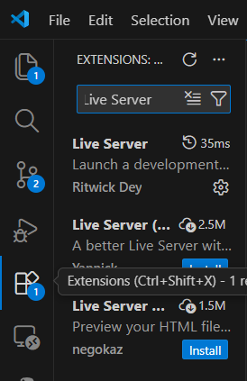

Apprendre à coder, c'est :

✅ Long mais POSSIBLE
✅ Frustrant mais GRATIFIANT
✅ Difficile mais ACCESSIBLE
✅ Demande de la DISCIPLINE
✅ Une compétence POUR LA VIE

La clé du succès :

Commencer doucement
Rester régulier
Faire des projets
Ne jamais abandonner

Résultat en screen.

Page déconnecte.

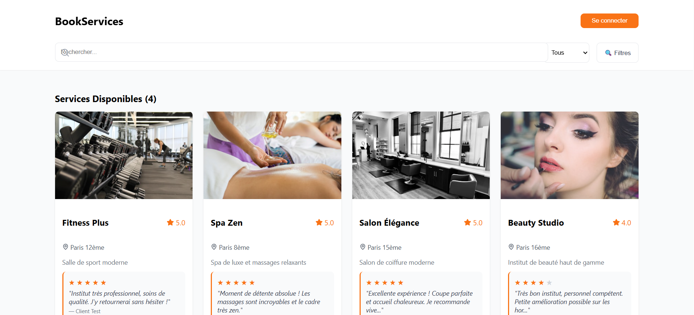
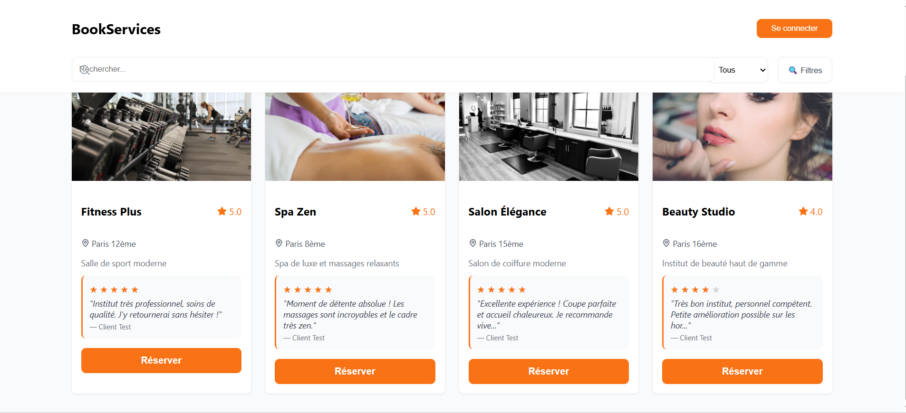
------------------------------------------
Il faut se connecter pour pouvoir faire une réservation
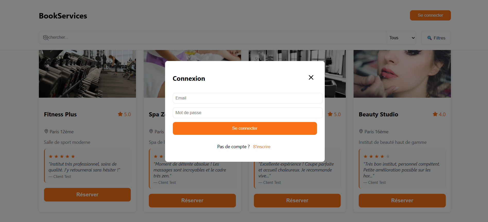
------------------------------------------
Email : nilton@test.com
Mot de passe : Test123!
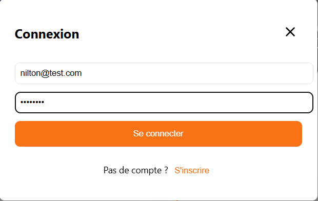
------------------------------------------
Connexion réussie :
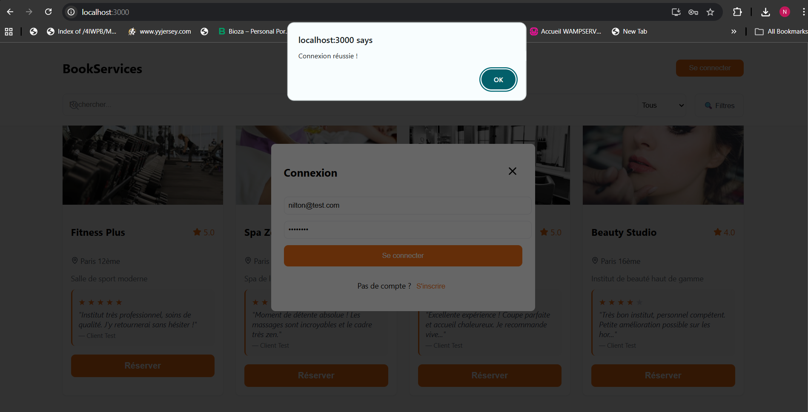
-----------------------------------------------
Je peux voir/confirmer/annuler mes réservations 
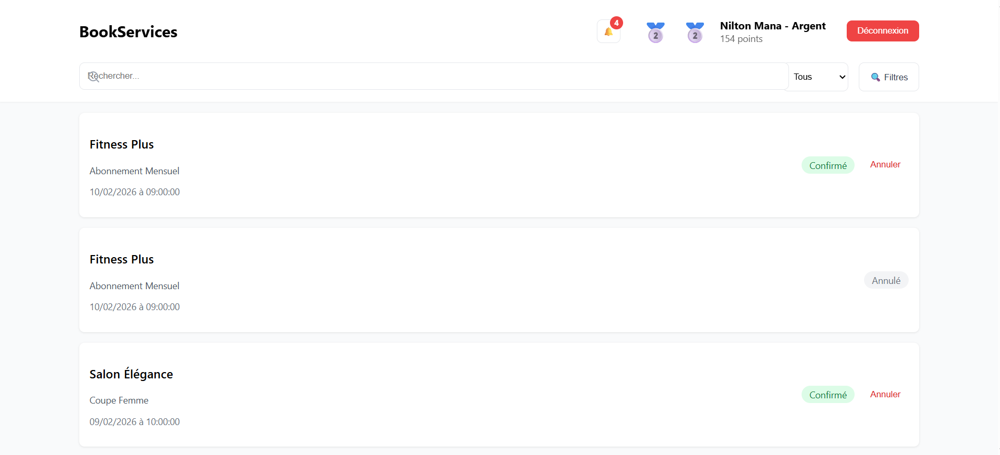
------------------------------------------------
Reserver - Salon Élégance
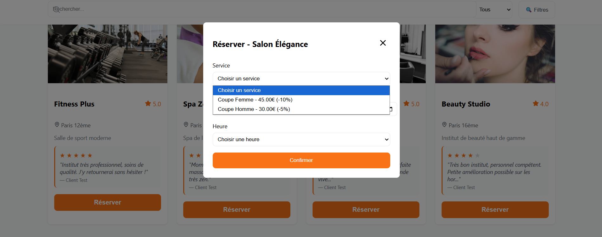
------------------------------------------
Réservation crée :
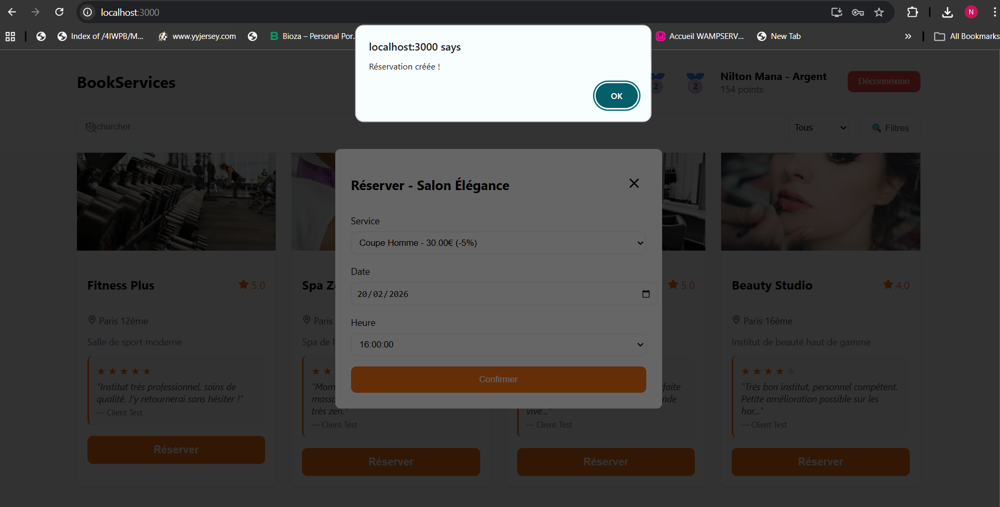
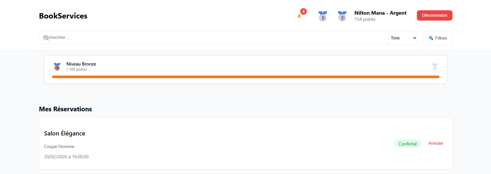
-------------------------------------------
Bonus - Menu :
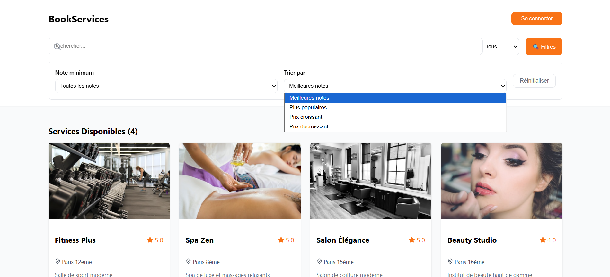
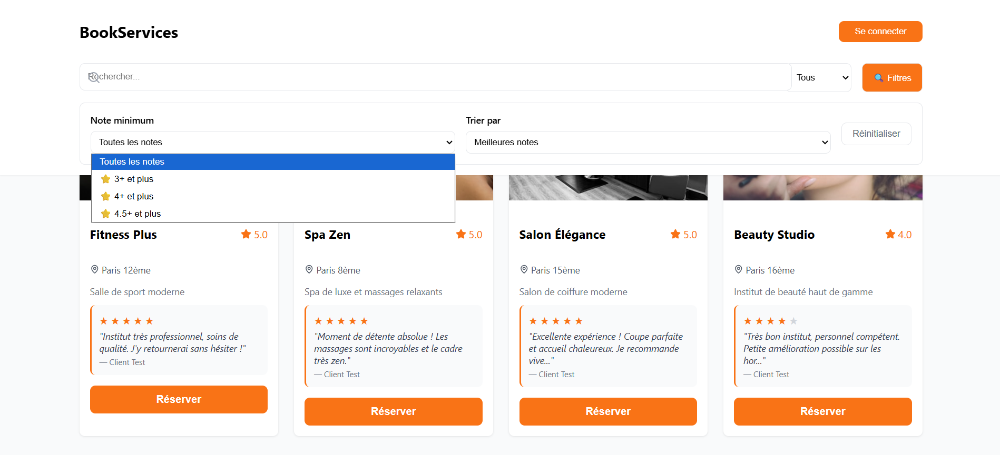

Le DashBoard :

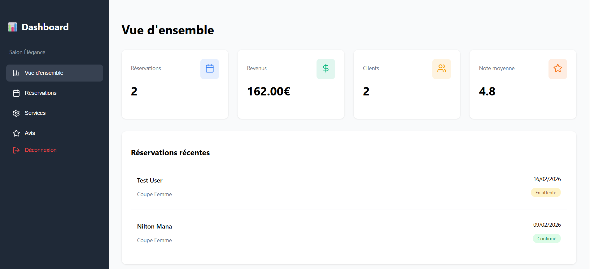